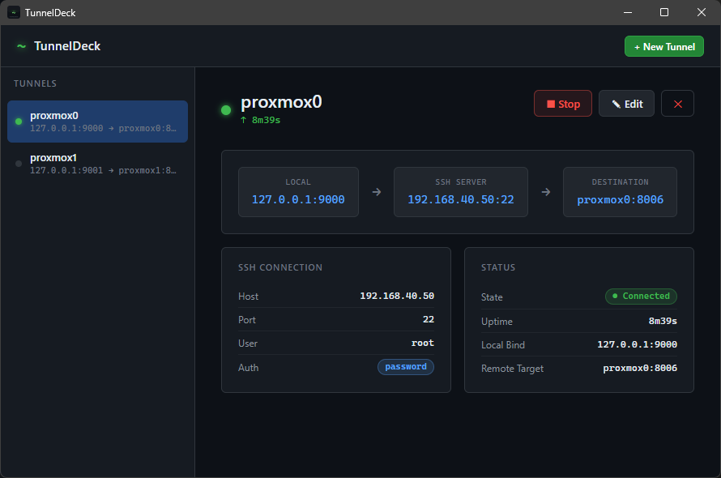

<div align="center">

# `~` TunnelDeck

**A beautiful desktop SSH tunnel manager built with Go + Wails**

[](https://go.dev)
[](https://wails.io)
[](LICENSE)
[]()

> Stop managing SSH tunnels in messy shell scripts. TunnelDeck gives you a clean, persistent GUI to create, run, and monitor all your tunnels in one place.



</div>

---

## Features

- **One-click tunnels** — start and stop SSH port forwards without touching the terminal
- **Password & key auth** — supports both password and private key authentication
- **Live status + uptime** — see which tunnels are active and how long they've been running
- **Persistent config** — tunnels are saved locally and restored on next launch
- **Clean shutdown** — all active tunnels are gracefully closed when the app exits
- **Lightweight** — single binary, no server, no cloud, no account required

---

## How It Works

TunnelDeck creates standard SSH local port forwards:

```
localhost:<localPort>  ──SSH──▶  <sshHost>  ──▶  <remoteHost>:<remotePort>
```

This is the equivalent of running:
```bash
ssh -L <localPort>:<remoteHost>:<remotePort> <user>@<sshHost>
```

...but with a GUI, persistence, and live status monitoring.

---

## Getting Started

### Prerequisites

- [Go 1.23+](https://go.dev/dl/)
- [Wails CLI v2](https://wails.io/docs/gettingstarted/installation)
- [Node.js 18+](https://nodejs.org/)

```bash
go install github.com/wailsapp/wails/v2/cmd/wails@latest
```

### Run in development mode

```bash
git clone https://github.com/creaked/tunneldeck
cd tunneldeck
wails dev
```

### Build a production binary

```bash
wails build
```

The output binary will be at `build/bin/tunneldeck.exe` (Windows) or `build/bin/tunneldeck` (macOS/Linux).

---

## Configuration

Tunnels are stored as a plain JSON file at:

| Platform | Path |
|---|---|
| Windows | `%APPDATA%\TunnelDeck\tunnels.json` |
| macOS | `~/Library/Application Support/TunnelDeck/tunnels.json` |
| Linux | `~/.config/TunnelDeck/tunnels.json` |

### Example `tunnels.json`

```json
{
  "tunnels": [
    {
      "id": "abc-123",
      "name": "Proxmox Home Lab",
      "sshHost": "192.168.1.10",
      "sshPort": 22,
      "user": "root",
      "authType": "key",
      "keyPath": "~/.ssh/id_rsa",
      "localPort": 8006,
      "remoteHost": "localhost",
      "remotePort": 8006
    }
  ]
}
```

---

## Tech Stack

| Layer | Technology |
|---|---|
| Backend | Go 1.23 |
| SSH | `golang.org/x/crypto/ssh` |
| Desktop runtime | [Wails v2](https://wails.io) |
| Frontend | Vanilla JS + Vite |
| IDs | `github.com/google/uuid` |

---

## Roadmap

- [x] Encrypted credential storage (Windows DPAPI / macOS Keychain / Linux AES-GCM)
- [x] SSH jump host / bastion support
- [x] Cross-platform builds & releases (GitHub Actions)
- [x] Auto-reconnect on tunnel drop
- [x] Settings menu
- [x] Auto-start tunnel on launch
- [ ] Import tunnels from `~/.ssh/config`
- [ ] System tray — minimize to tray while tunnels keep running
- [ ] Tunnel groups / tags
- [ ] Traffic stats (bytes in/out per tunnel)

---

## Contributing

PRs welcome. To get started:

1. Fork the repo
2. Create a feature branch — `git checkout -b feat/my-feature`
3. Make your changes
4. Open a PR with a clear description

Please open an issue first for large changes.

---

## License

MIT © [Will Chellman](https://github.com/creaked)
